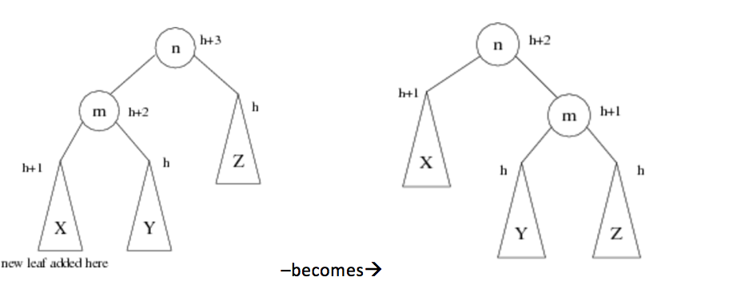
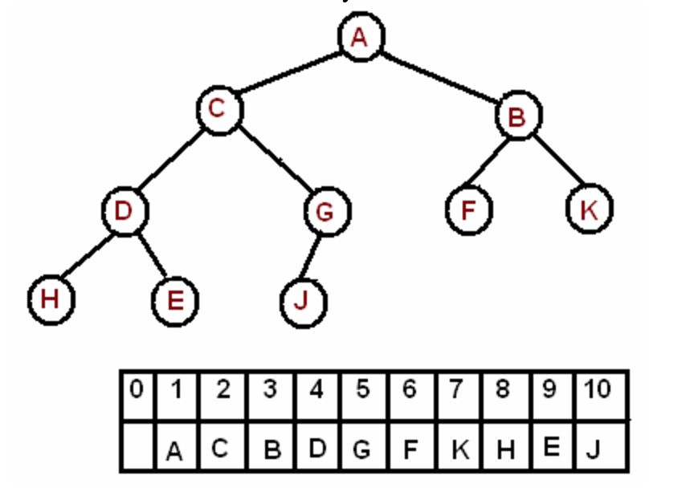
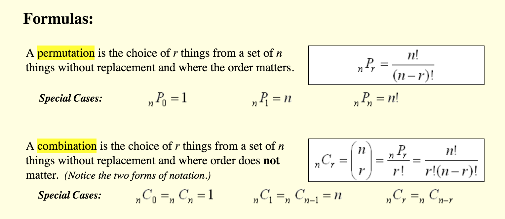

# Sorting:

* [Sortin Visualizations Website](https://www.toptal.com/developers/sorting-algorithms)

## Insertion Sort

* IDEA: starting from front, swap element down one slot at a time until it's in the right place
* Outer loop invariant: [1..i] is sorted
* TIME: O(n^2)
* SPACE: O(1)
* PRO: stable (preserves relative order among equally ranked items), best for nearly sorted data and small problem sizes (low overhead)
* CON: O(n^2)

```python
def ins_sort(array):
  for i in range(1,len(array)):
    j = i
    while j > 0 and array[j] < array[j-1]:
      array[j], array[j-1] = array[j-1], array[j]
      j=j-1
  return array
  ```

## Bubble Sort

* Swap elements down starting from back

## Selection Sort

* Repeatedly swap next element with largest element

## Quick Sort

* IDEA: Repeatedly pick a pivot, move elements less then pivot to left, others to right, and repeat on left and right.
* TIME: O(n^2) worst, O(n log n) avg
* SPACE:
  * In place implementation: O(n) worst O(log n) avg
  * super smart implementation: O(log n) worst by only recursing on half and using loop on other
  * stupid implementation: O(n^2) worst
* PRO: usually fast, elegant, not stable without taking extra measures
* CON: O(n^2)

```python
def sort(array=[12,4,5,6,7,3,1,15]):
    less, equal, greater = [], [], []
    if len(array) > 1:
        pivot = array[0]
        for x in array:
            if x < pivot:
                less.append(x)
            if x == pivot:
                equal.append(x)
            if x > pivot:
                greater.append(x)
        return sort(less)+equal+sort(greater)
    else:
        return array
```
This naive implementation always picks the first element as the pivot (as opposed to a random element) meaning it performs worst on already sorted data. Also, it's naively not in place and takes O(n^2 space worst case)

## Merge Sort

* IDEA: Split array into elements, join pairs of two into subarrays in sorted order, then join those pairs in sorted order, and so on.
* TIME: O(n log n) worst
* SPACE: O(log n) for in place, O(n) for generic
* PRO: stable, best for linked lists and when random access is expensive, in place merge variations exist but are complicated, good for external sorts and easy to parallelize because chunks of data independently processed
* CON: not adaptive, always takes O(n log n)

```python
def merge_sort(array):
    if len(array) <= 1:
        return array
    mid = len(array) / 2
    left = merge_sort(array[:mid])
    right = merge_sort(array[mid:])
    return merge(left, right)

def merge(left, right):
    if not left:
        return right
    if not right:
        return left
    if left[0] < right[0]:
        return [left[0]] + merge(left[1:], right)
    return [right[0]] + merge(left, right[1:])
```

## Heap Sort

* IDEA: build max-heap, then repeatedly extra max element and place it at back
* See Heap section
* TIME: O(n log n) - build heap is O(n) + extract max n times is O(n log n)
* SPACE: O(1), in place
* PRO: in place, strict space bound so good guarantees for embedded and security
* CON: bad locality, not stable, not easy to parallelize

# Algorithms

## bottom-up vs top-down

* Dynamic programming is bottom up, recursive solutions are top-down

## Binary Search

* IDEA: given sorted array, repeatedly select the halfway point, then recurse on appropriate half
* TIME: O(log n)
* SPACE: O(1)

## Divide and Conquer

* IDEA: Split a problem into subproblems
* EXAMPLES: mergesort, quicksort, top-down parsing, FFT
* Good for parallelism because subproblems typically independent

## Dynamic Programming and Memoization

* IDEA: avoid recomputation

### LIS Longest Increasing Subsequence

```
LIS Longest Increasing Subsequence
Input: x1, x2, ... , xn
Output: Length of LIS

T[i] = length of LIS ending in xi

T[i] = max j (1 + T[j] : 1 <= j <= n, xj < xi)
```

### LCS Longest Common Subsequence

```
LCS Longest Common Subsequence
Input: x1, x2, ... , xn
       y1, y2, ... , yn
Output: length of LIS

T[i,j] = length of LIS ending in xi and yj

T[i,j] = max {
    1) T[i-1,j-1] + (xi == yj)
    2) T[i-1,j]
    3) T[i,j-1]
}
```
### Longest Common Substring

```
LCSubstring
Input: x1, x2, ... , xn
       y1, y2, ... , yn
Output: length of LCSubstring

T[i,j] = length of LCS ending in xi and yj
T[i,j] = T[i-1,j-1] + (xi == yj)
```

### Knapsack Problem

```
Knapsack:
Input:  items with
        weights:    w1, w2, ... , wn
        values:     v1, v2, ... , vn
        Capacity B
Output:
    max value you can get while under capacity, no repeats

T[i,b] = max value using items of subset 1..i and capacity b

T[i,b] = (wi <= b)
    ? max(T[i-1, b-wi] + vi, T[i-1,b])
    : T[i-1,b]

Knapsack with unlimited supply:
T[b] = max value using available items with capacity b
T[b] = max(1 <= j <= n) { T[b-wj] + vj : wj <= b }
```

## Greedy Algorithms

* IDEA: select best local solution, doesn't always produce global optimum but relatively good and reasonable time
* Example: Dijkstra's, Prim's

## MST Algorithms

* Problem: Given graph, find minimum cost tree of edges such that every node is connected

### Prim's Algorithm

* Starting from any node, repeatedly add the lowest cost edge to unconnected neighbor from working set, greedy

### Kruskal's Algorithm

* Repeatedly add lowest cost edge that doesn't result in a cycle

## DFS

* PROBLEM: Find path to element
* IDEA: Explore path as far as possible before backtracking
* TIME: O(E + V) == O(E) because V^2 < E
  * Every vertex is added to working set once, each edge is looked at exactly twice (or once for directed graph)
* SPACE: O(V) (up to V stored search)

```python
# Adjacency list graph
graph = {'A': set(['B', 'C']),
         'B': set(['A', 'D', 'E']),
         'C': set(['A', 'F']),
         'D': set(['B']),
         'E': set(['B', 'F']),
         'F': set(['C', 'E'])}

# iterative
def dfs(graph, start):
    visited, stack = set(), [start]
    while stack:
        vertex = stack.pop()
        if vertex not in visited:
            visited.add(vertex)
            stack.extend(graph[vertex] - visited) # set subtraction
    return visited

# recursive
def dfs(graph, start, visited=None):
    if visited is None:
        visited = set()
    visited.add(start)
    for next in graph[start] - visited:
        dfs(graph, next, visited)
    return visited
```

## BFS


* TIME: O(E + V)
* SPACE: O(V) (up to V stored search)

```python
def bfs(graph, start):
    visited, queue = set(), [start]
    while queue:
        vertex = queue.pop(0)
        if vertex not in visited:
            visited.add(vertex)
            queue.extend(graph[vertex] - visited)
    return visited
```

## Dijkstras

* PROBLEM: Finds shortest path form source node to all other nodes
* IDEA: All nodes start at infinite total cost. Repeatedly add lowest cost neighbor to working set, and lower total cost of all neighbors of added node, and repeat.
* Like BFS but with weights and neighbors dequeued by min cost, not round
* TIME:
  * Minheap: O((E + V) log V) (same as BFS but inserting and updating takes O(log (V)))

```
 1  function Dijkstra(Graph, source):
 2
 3      create vertex set Q
 4
 5      for each vertex v in Graph:             // Initialization
 6          dist[v] ← INFINITY                  // Unknown distance from source to v
 7          prev[v] ← UNDEFINED                 // Previous node in optimal path from source
 8          add v to Q                          // All nodes initially in Q (unvisited nodes)
 9
10      dist[source] ← 0                        // Distance from source to source
11      
12      while Q is not empty:
13          u ← vertex in Q with min dist[u]    // Source node will be selected first
14          remove u from Q 
15          
16          for each neighbor v of u:           // where v is still in Q.
17              alt ← dist[u] + length(u, v)
18              if alt < dist[v]:               // A shorter path to v has been found
19                  dist[v] ← alt 
20                  prev[v] ← u 
21
22      return dist[], prev[]
```

## A*

# NP Completeness

## Decision Problem

* Has yes or no answer

## P Polynomail time

* Set of all decision problems that can be solved in polynomial time

## NP

* Set of all decision problems for which the instances where the answer is "yes" have proofs that can be verified in polynomial time.

## NP-Complete

* Set of all problems X in NP for which it is possible to reduce any other NP problem Y to X in polynomial time.

* To Prove problem X is NP-Completeness show:
  1.  X is in NP
      * By showing how to verify a certificate - a solution  - in polynomial time
  2. Show a known NP-Complete problem Y reduces to X (so if you can solve X, then you can solve Y)
      * Show how to transform an instance y of Y into an instance x of X, then show that x is in X iff y is in Y

## NP-Hard

* A problem X is NP-hard, if there is an NP-complete problem Y, such that Y is reducible to X in polynomial time. 
  * Drops requirement of being in NP so NP-Complete is a subset of NP-hard

* Intuitively, these are the problems that are at least as hard as the NP-complete problems. Note that NP-hard problems do not have to be in NP, and they do not have to be decision problems.

* But since any NP-complete problem can be reduced to any other NP-complete problem in polynomial time, all NP-complete problems can be reduced to any NP-hard problem in polynomial time. Then, if there is a solution to one NP-hard problem in polynomial time, there is a solution to all NP problems in polynomial time.

* Halting problem is NP-hard

## P = NP?

* P is a subset of NP. But is it equal? No one has been able to prove or disprove.

## Common NP-Complete Problems

* CLIQUE: Does there exist a clique of size ≥ k in a graph G?
The certificate is the subset of k vertices that are in the clique, and then the verifier will check if there is an edge between every pair of vertices.

* INDEPENDENT SET: Does there exist an independent (set of vertices no two of which share and edge) set of size ≥ k in a graph G?
As with clique, verifier takes a set of vertices with size ≥ k and check if every pair of vertices have no edge.

* HAMILTONIAN CYCLE: Does there exists a Hamiltonian cycle (a cycle of length n, using each vertex exactly once) in G?

* VERTEX COVER: Does there exist a vertex cover of size ≤ k in G?
Recall a vertex cover is a set of vertices such that each edge has at least one of its endpoints in the set.

* TSP: Does there exist a tour in G that visits every vertex and returns to the origin, and has length ≤ L?

*  KNAPSACK: Given a set of items, each with a weight and a value, determine the number of each item to include in a collection so that the total weight is less than or equal to a given limit and the total value is as large as possible

* INTEGER LINEAR PROGRAMMING (ILP): Given A \in \mathbb{R}^{m \times n}, b \in \mathbb{R}^m, does there exist an x \in \mathbb{Z}^n such that A x ≥ b?
The certificate is the vector x. We check if A x ≥ b and that x is all integers.

* SAT: Given a satisfiability instance F, does there exist a boolean assignment x such that F(x) is true?

# Data Structures

## Trees

### Trie Trees

* IDEA: A tree in which each node corresponds to adding a character to the substring ending at parent's node. Can optinally associate values with nodes
* APPLICATION: efficient dictionary (see if a word is valid) though FSMs can be more storage efficient
* TIME: O(m) where m is max length string
* PRO: innately provides alphabetical ordering,
  * VS hashtables: better worst case lookup (at most size of string vs number of entries), no collisions so no buckets needed unless key is inserted twice, no hash function
* CONS: not meaningful for datatypes like floating point, more space
  * VS hashtables: slower data lookup on avg, especially for external high random access cost storage

### Binary tree

* Can be reconstructed from: inorder and preorder, or inorder and postoder, but not preorder and postorder
* If you know binary tree is full, then preorder and postorder are sufficient


### Binary Search Trees - one of red/black, splay or AVL

#### Red Black Tree

#### AVL Tree

* [Web doc](http://pages.cs.wisc.edu/~ealexand/cs367/NOTES/AVL-Trees/index.html)
* IDEA: store height of subtree rooted at each node, walk down tree to perform insert, on way back up, perform rotations to rebalance
* TIME:
  * Insert: O(log n)
  * Delete: O(log n)
  * Search: O(log n)
* ROTATIONS:
  * Type 1

  * Type 2


#### Splay Tree 

## Hash Tables

* IDEA: associative array mapping keys to values where inserted slot index computed from hash of key
* Key stored with value to differentiate items with same hash
* CONCERNS: Linked list or next slot, resizing, hash function cost, bad locality of reference, exploitable by attackers who insert many identically hashed items
* TIME:
  * Search: O(1) or O(n)
  * Insert: O(1) or O(n)
  * Delete: O(1) or O(n)

## Hashtable vs HashMap vs HashSet vs Dictionary

* Hashtable: no null keys, no null values, synchronized (one thread accesses it at a time)
* Hashmap: one null key and null values allowed, not synchronized
* HashSet: one null key allowed, no values, not synchronized

## Heaps

* IDEA: balanced tree in which parent always greater than children and every level is full except lowest level which is filled left-to-right

### Binary Heap

* APPLICATION: priority queue
* INSERT: place in left-most unoccupied spot on bottom then bubble up
* DELETE_MAX: remove and return root, swap for last element, then bubble down
* Array stored as follows: left child at index 2 * i, right child at 2 * i + 1


## Priority Queue

* Efficiently implemented with heap

# Probability and Combinatorics

## Combination

* Order doesn't matter
* 5 shirts, 6 socks, 10 pants = 5 * 6 * 10 possible combinations

## Permutation

* Order matters



# Graphs

## Representations

### Objects and pointers

### Matrix

* PRO: O(1) edge existence query
* CON: Wasted space for sparse graphs
* Half of entries unused/duplicated on undirected graphs
* SPACE: O(V^2)

## Adjacency list

* PRO: no wasted space
* CON: O(V) query for edge existence
* SPACE: O(E + V)

# OS

## Processes

* Processes contains 1+ threads executing in shared memory space
* RESOURCES: virtual address space, code, handles to system objects, security context, variable, process_id, priority class

## Threads

* RESOURCES: stack, registers, thread_id, thread scheduling priority, exception handlers, 

## Concurrency Issues

## Locks

## Spin lock

* Thread loops doing nothing repeatedly checking until lock becomes available, called spinning or BUSY-WAITING
* Avoid context switching overhead so good for short expected times, but wasteful
* Often better to just sleep rather than loop
* Used often by OS kernels

## Mutexes

## Semaphores

## Monitors

* A Monitor is a lock belonging to a single object, and additional condition variables
* Protect access to the methods of a single object
* Ony one thread can execute within a procedure at a time
* But threads can wait within a procedure in a queue until a certain condition is true, releasing the monitor while they're waiting

```
acquire(m); // Acquire this monitor's lock.
while (!p) { // While the condition/predicate/assertion that we are waiting for is not true...
	wait(m, cv); // Wait on this monitor's lock and condition variable.
}
// ... Critical section of code goes here ...
signal(cv2); -- OR -- notifyAll(cv2); // cv2 might be the same as cv or different.
release(m); // Release this monitor's lock.
```

## Atomic Operations

### Test-and-Set

```
function TestAndSet(boolean_ref lock) {
    boolean initial = lock;
    lock = true;
    return initial;
}

boolean lock = false
function Critical(){
    while TestAndSet(lock) skip // spin until lock is acquired
    critical section // only one process can be in this section at a time
    lock = false // release lock when finished with the critical section
}
```
## Deadlock

* NECESSARRY CONDITIONS:
  1. Mutual exclusion
  2. Hold and Wait
  3. No preemption
  4. Circular dependency

## Livelock

* Like Deadlock, but states change, though no progress happens. Hard to detect

## Scheduling

## Modern Concurrency constructs and Parallelism

## IPC Interprocess Communication

* Message passing
* Shared memory
* Pipes
* File
* Socket
* Semaphore
* Memory mapped file

## Context Switching

1. Interrupt (software or hardware)
2. Kernel Mode
3. State save: registers, PC, PCB
4. Select available process
5. Load it in
6. Change to usermode and give execution

## Priority Inversion

* Low priority task holds a resource needed by a high priority task, but can't run to release it because medium priority task takes precedence

## Thrashing

* Memory is overprovisioned, so useful pages are evicted, all time is spent paging in and out, and everything stalls

## TLB

* Cache of Page table entries (VPN to PPN)

## Page Table

* Per-process table of mappings from Virtual page numbers to physical page numbers

# System Design

## Feature Sets

## Interfaces

## Class Hierarchies

## Distributed Systems

## Goals

### Constraints

### Simplicity

### Limitations

### Robustness

## Tradeoffs

# Internet

## IP

* PACKET FORMAT: Length, ID, Fragment offset, TTL, Next-level-Protocol (e.g. TCP), header checksum, source address, destination address, options

## TCP

* PACKET FORMAT: Source Port, Destination Port, Sequence #, Ack #, Data offset, Sender Window Size, Checksum, Options

* 3-WAY HANDSHAKE: 1. SYN, 2. SYN, ACK, 3. ACK

## Routers

## DNS

* Your computer OS -> Root resolver (often ISP) -> Root DNS -> TLD DNS -> 2nd level DNS

## Load Balancers

## Firewalls

